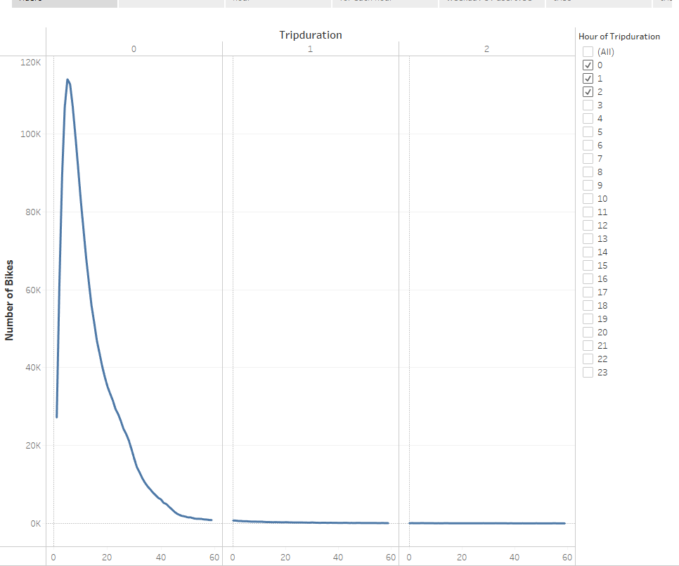
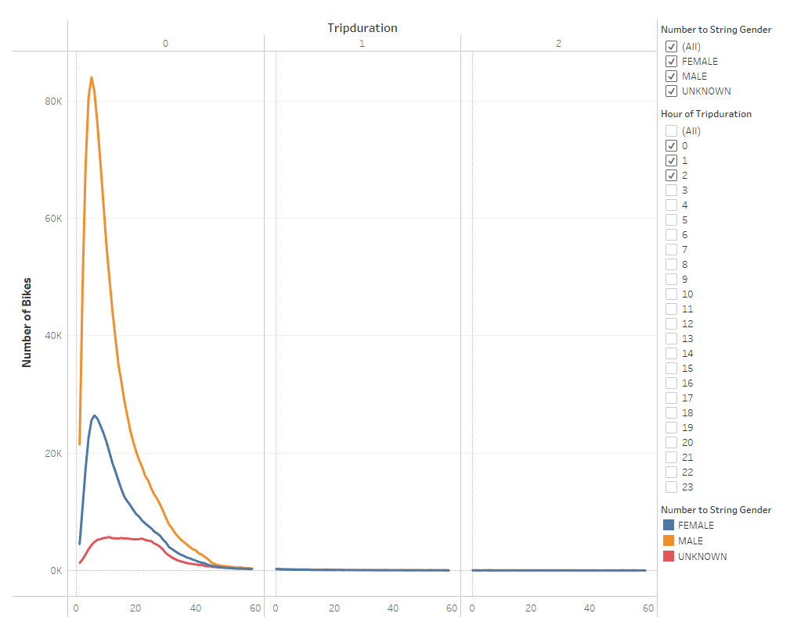
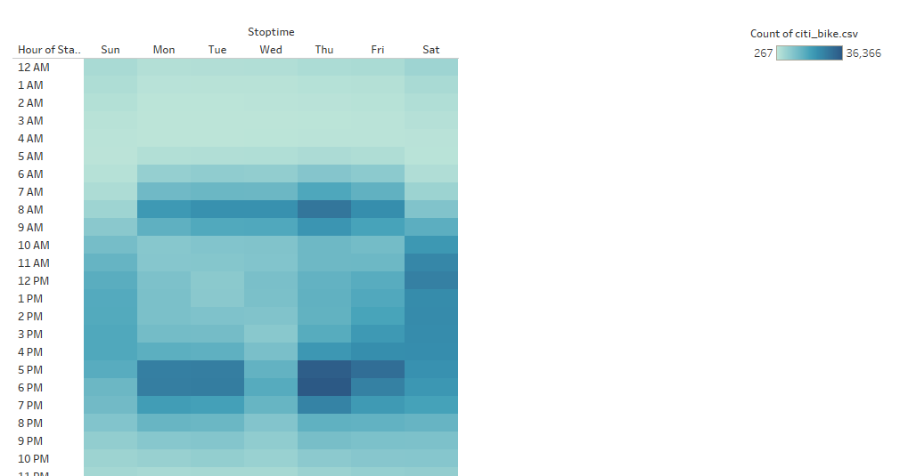
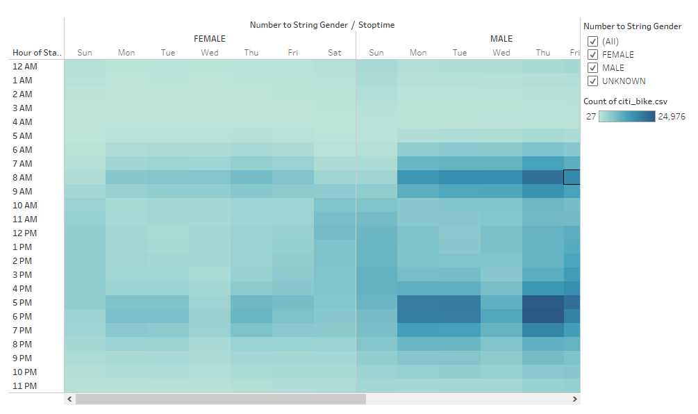
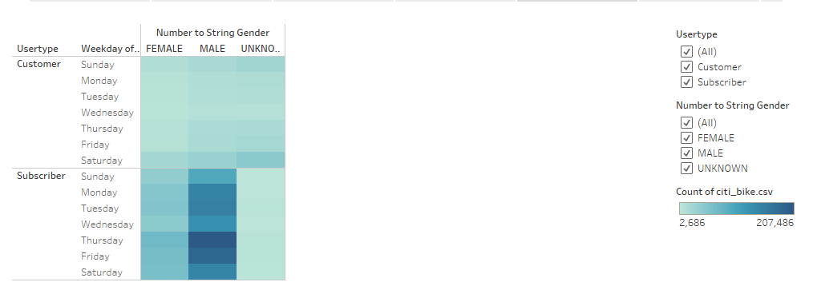
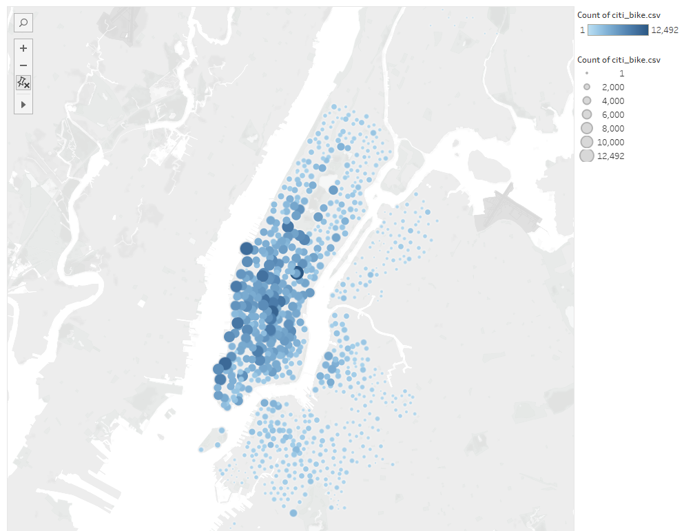
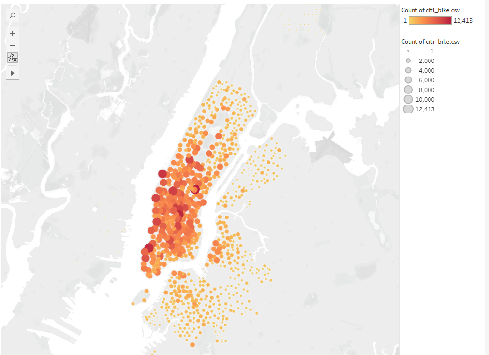

# Bikesharing Analysis
 Tableau

### Module 14 CitiBike Challenge 
**Deliverable 1:** [Deliverable1](NYC_CitiBike_Challenge.ipynb)
**Tableau Public Link:** [link to tableau public](https://public.tableau.com/views/Citi_Bike_Challenge_16384791042350/CitiBikeStory?:language=en-US&publish=yes&:display_count=n&:origin=viz_share_link)

## Overview:
The purpose of this analysis was to better understand the trends from Citibike in New York City to apply to a similar business locally. 

## Results:

- Length of time bikes are checked out for all riders

- Number of bikes checked out by gender

- Number of bike trips by weekday for each hour 

- Number of bike trips by gender by weekday for each hour

- Number of bike trips by gender for each weekday by usertype

- Top starting locations by number of bike trips

- Top ending location by number of bike trips

## Summary:
- From our analysis Male riders are the predominant users of the bike service, Thursdays from 5-6pm bike trips are the highest, Females and Males have similar patterns in when they take their bike trips, and Thursday, Friday and Saturday are the most popular days for bike trips for both male and female suscribers. Two visualizations that can be added are the correlations between birthyear and tripduration, and another one on the most used starting locations by bikeid.

